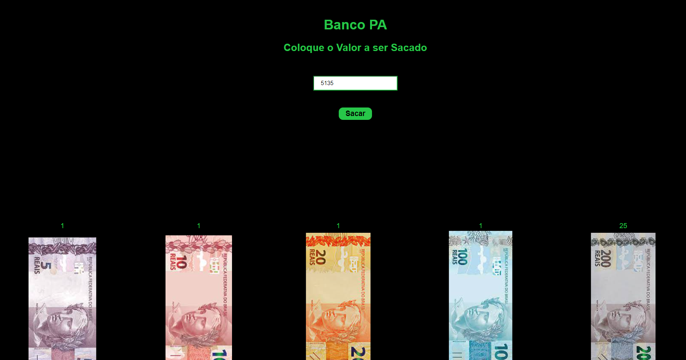

# Cash Machine

**Número da Lista**: 40 
**Conteúdo da Disciplina**: Greed 

## Alunos
|Matrícula | Aluno |
| -- | -- |
| 16/0112028  |  André Goretti Motta |

## Sobre 
Cash Machine é uma pequena aplicação que simula um saque de banco, onde você coloca o valor desejado para saque e ele te da o menor valor de cédulas possivel. 

## Screenshots

## Instalação 
**Linguagem**: Javascript 
**Framework**: React 
Uma vez detro do repositório, basta entrar na pasta "cash-machine":

>cd cash-machine

e rodar:
> npm install

Depois o comando:

> npm start

## Uso 

Para usar o programa basta entrar no endereço:

> localhost:3000

e digitar o valor desejado e clicar em sacar.

